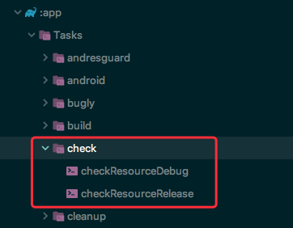
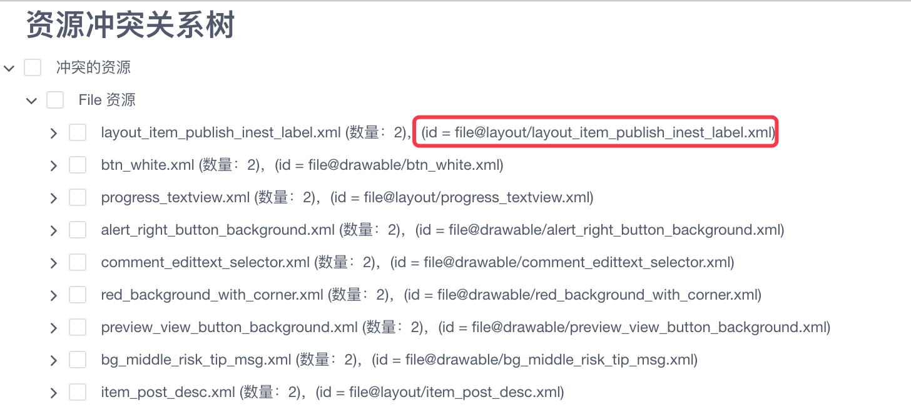
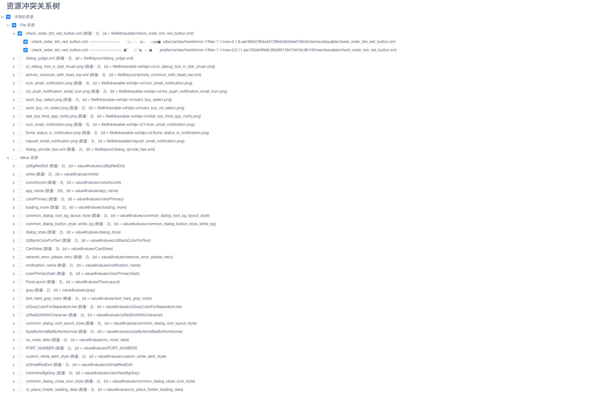
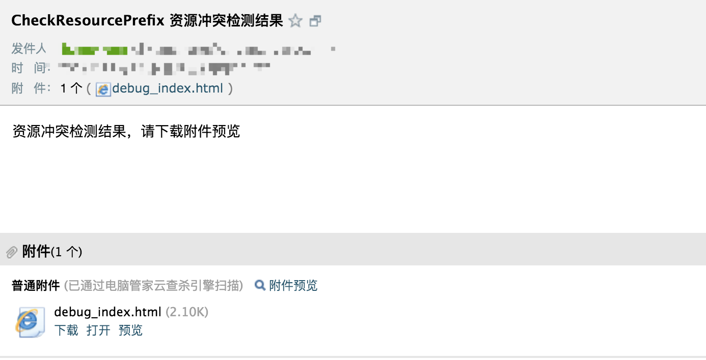

[项目地址：https://github.com/hust201010701/CheckResourceConflict](https://github.com/hust201010701/CheckResourceConflict)

[](https://bintray.com/orzangleli/maven/checkresourceconflict/_latestVersion)

## 一、 引言

在 Android 的日常开发中，我们会使用到大量的第三方库或者自己编写的组件库，这些依赖库中资源加上主工程本身的资源，可能会发生同名冲突，会发生资源相互覆盖的现象。

由于资源覆盖不会有任何提示，而且只会在 APP 运行到相关代码时暴露出来，如果测试不细致的话，很容易把问题带到线上，造成严重后果。在我的业务开发过程中，就发生过两起由于资源覆盖导致的实际问题：

1. 颜色资源被覆盖

我们有两款 APP 分别记作 A 和 B，它们同时依赖了一个对话框组件记作 C，C中有个颜色资源名为 `@color/main_color`，B 项目在主工程中也同时声明了一个同名的颜色，但是资源的值与组件 C 中不一样，最终导致 B 项目中的对话框显示效果异常。

2. 布局资源被覆盖

如果你认为颜色资源被覆盖最多只影响显示效果，并不算严重的话，那么再来看这个布局资源被覆盖的问题，它是有可能引起崩溃的。
我们有个已有的业务，相关程序都在主工程中，由于一些需求，需要把这个业务相关的代码迁移到一个独立的组件库中，我们在迁移的过程中，有些自定义View页跟随迁移了。但是由于粗心原因，主工程的原有资源并没有删除。当我们使用布局资源时，主工程中的 layout 布局文件会覆盖组件中的布局文件，当我们在 Java 文件中使用 `findViewById` 去绑定 id 时，布局中的 View 的包名是老包名，而java 文件中的 View 的包名是新包名，在运行时就会发生类型转换失败的崩溃。举个例子，主工程中有个自定义控件 `package.a.view.CircleWithBorderView`，迁移到 A 组件中后包名发生变化，变成了 `package.b.view.CircleWithBorderView`，在组件 A 某个布局 activity_main.xml 中使用到了这个控件，而且对应的java文件中，我们使用的都是 `package.b.view.CircleWithBorderView` 包下的自定义控件，没有任何问题。但是在接入主工程时，由于主工程的 `activity_main.xml` 并没有删除，而主工程中 `activity_main.xml` 使用的 `package.a.view.CircleWithBorderView` 下的自定义控件，这样在运行时就会发生崩溃现象。

```
<package.a.view.CircleWithBorderView
    android:layout_width="wrap_content"
    android:layout_height="wrap_content"/>
```

在了解同名资源被覆盖，会产生一些难以及时发现的问题时，我们需要思考如何避免这种问题的产生。

## 二、 解决思路

如果我们能够在编译期间，把所有冲突的资源找出来，告诉开发者有哪些资源同名但是内容不同，让开发者在最终发版前将这些同名资源处理掉。处理的方式可以有两种：

1. 如果冲突的资源应该保持一致，可以将其中一份资源删除，或者保持资源内容一致；
2. 如果冲突的资源本身就不应该一致，那么可以将其中一个资源增加前缀防止资源被覆盖。

### 资源类型
资源按照类型来区分，可以分为两种，区分的规则是文件类型整个文件占用一个 `R.id`，而值类型的资源每一项元素占用一个 `R.id`：

- 值类型：比如 @color/black， @dimen/screen_width 等对应xml文件中声明的每一项子元素
- 文件类型： 比如 drawable-xxhdpi 文件夹下的图片资源，layout 文件夹下的布局文件

### 如何区分资源类型
那程序需要怎么区分某个文件是否是值类型还是文件类型呢？

我们可以根据这个这个文件所在目录的目录名是否 `values` 或者 以`values-`开头进行判断。

### 如何判断资源冲突

要判断一个资源存在冲突，我们需要处理两件事：一是给资源确定唯一的id，二是如何判断资源的值是否发生冲突；

**资源确定唯一的id**

对于文件资源，举个例子， `res/drawable-xxhdpi/a.png` 与 `res/drawable-xxxhdpi/a.png` 即使文件不同也不会发生冲突，但是 A 组件中的 `res/drawable-xxhdpi/a.png` 和 B 组件中的 `res/drawable-xxhdpi/a.png` 会发生冲突，所以对于文件资源，唯一id可以确定为 `file@文件所在文件夹名称/文件名`， 如`file@layout/activity_main.xml`。

对于值类型的资源，举个例子， `res/values/colors.xml` 与 `res/values/values.xml` 中声明的 `main_color` 会发生冲突，而 `res/values/colors.xml` 与 `res/values-v19/colors.xml` 中的 `main_color` 不会发生冲突，所以对于值类型资源，与所在文件名无关，唯一id可以确定为 `alue@资源所在文件的上层文件夹名称/资源名`， 如`value@values/main_color`。

**资源值是否冲突**

对于文件类型资源，我们可以计算文件对于的md5是否相等来判断是否冲突；
对于值类型资源，我们可以直接比较值的内容是否一样。

## 三、解决方案

我们的方案已经很清晰了。万事具备只欠东风，只需要在编译期间能够获取所有的资源文件就可以了。

Android Gradle Plugin 3.3 版本及其以上，提供了一个 API 可以获取编译所有的资源文件。

```groovy
variants.forEach { variant ->
    variant as BaseVariantImpl
    // files 即对应所有的编译资源
    def files = variant.allRawAndroidResources.files
```

我使用这套 API 开发了一套编译期间自动查找所有冲突资源的插件，项目地址： CheckResourceConflict [https://github.com/hust201010701/CheckResourceConflict](https://github.com/hust201010701/CheckResourceConflict)


## 四、CheckResourceConflict 插件

### 4.1 特性介绍

- 支持所有res文件夹下资源：文件类型+值类型
- 资源冲突输出html格式树形图
- 支持指定html文件输出目录
- 支持资源白名单，即使冲突也不记录
- 检测完成后支持邮件通知

### 4.2 使用方法

#### 1. 添加依赖

```
buildscript {
    repositories {
        jcenter()
    }
    dependencies {
        classpath 'com.orzangleli:checkresourceconflict:0.0.1'
    }
}
```

#### 2. 使用插件

在你的项目的 build.gradle 文件中增加:

`apply plugin: 'CheckResourcePrefixPlugin'`

#### 3. 运行任务

有两种方式可以运行资源冲突检测任务

- 添加插件后，会在 `check` 目录下生产若干个任务，可以根据需要执行相关任务，



- 在编译apk的过程中也会自动执行相应的任务

#### 4. 可配置项

```
checkResourceConfig {
    // 是否开启插件
    enabled false
    // 运行完后自动使用默认浏览器打开html结果进行预览
    autoPreviewResult true
    // 输出文档的目录
    outputDir "./out"
    // 资源冲突白名单
    whiteListFile "../checkResource/whitelist.lxc"
    // 邮件相关配置
    emailConfig {
        // 是否开启邮件发送功能
        needSendEmail true
        // 邮箱指定的 email host
        host ""
        // 发件人邮箱
        fromEmail ""
        // 收件人邮箱 支持多人
        toEmailList ("", "")
        // 邮箱账号
        account ""
        // 邮箱授权第三方客户端的授权码
        authorizationCode ""
    }
}
```

#### 5. 白名单规则

```
# 「#」开头表示该行为注释
# 这个文件可以声明检测资源冲突的白名单资源
# 文件资源的格式为 file@文件所在文件夹名称/文件名， 如 file@layout/activity_main.xml
# 值类型资源的格式为 value@资源所在文件的上层文件夹名称/资源名， 如 value@values/colorPrimary

value@values/error_color_material_dark
file@layout/notification_action_tombstone.xml
```
其中 `value@values/error_color_material_dark` 和 `file@layout/notification_action_tombstone.xml` 表示的是资源id，可以从输出的html文档中找到资源对应的id。



#### 6. 注意事项

- 不支持 assets 中资源冲突检测
- 不支持 android gradle plugin 3.3 以下版本

#### 7. 使用效果

Tips：

- 已经处理过的冲突可以使用勾选框标记。
- 邮箱中html预览功能无法正常显示，请下载后预览本地文件




